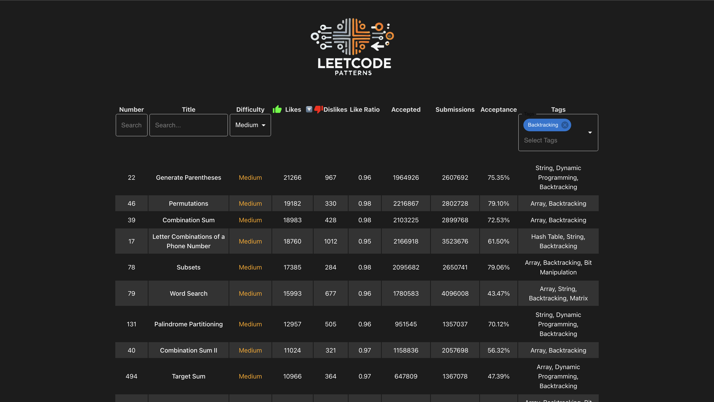

# Leetcode Problems Filtered and Sorted
Web application that allows you to filter and sort LeetCode problems by multiple tags (e.g., Array, Binary Search) and other metrics, including likes dislike ratio, submissions count and accepted submissions count.

The JSON file storing the parsed problem information is located at `./src/assets/problems.json`. This file is regularly updated and available for your use.

For any suggestions, please feel free to create an issue.

## Features

- Filter LeetCode problems by multiple tags simultaneously.
- Sort problems by various metrics like likes, dislikes, total submissions and accepted submissions.
- Problem list fetched using GraphQL and updated daily.

## Upcoming Features

- Display user profiles and metrics by using the provided LeetCode username.

## Live URL

Check out the live version here: [Leetcode Patterns](https://leetcodepatterns.vercel.app)

## Screenshot

## Acknowledgements

- [LeetCode](https://leetcode.com) 
- [akarsh1995/leetcode-graphql-queries](https://github.com/akarsh1995/leetcode-graphql-queries/) for inspiring the GraphQL queries.
- [adixmr/leetcode](https://github.com/adixmr/leetcode/tree/main) for project idea inspiration.

## Technologies Used

- **Node.js**: Backend runtime environment.
- **GraphQL**: Query language for fetching LeetCode problems.
- **React**: Frontend library for building the user interface.
- **MUI**: UI library for React.

## License

This project is licensed under the [MIT License](https://choosealicense.com/licenses/mit/).
